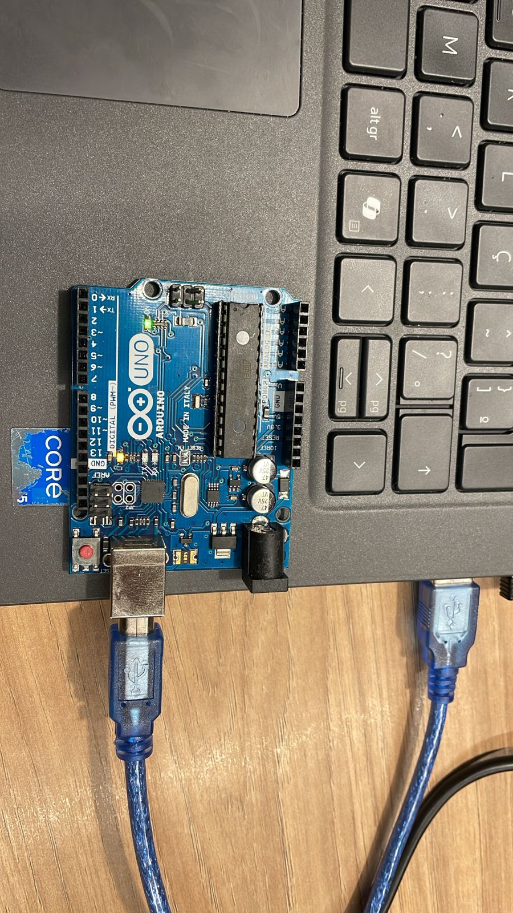
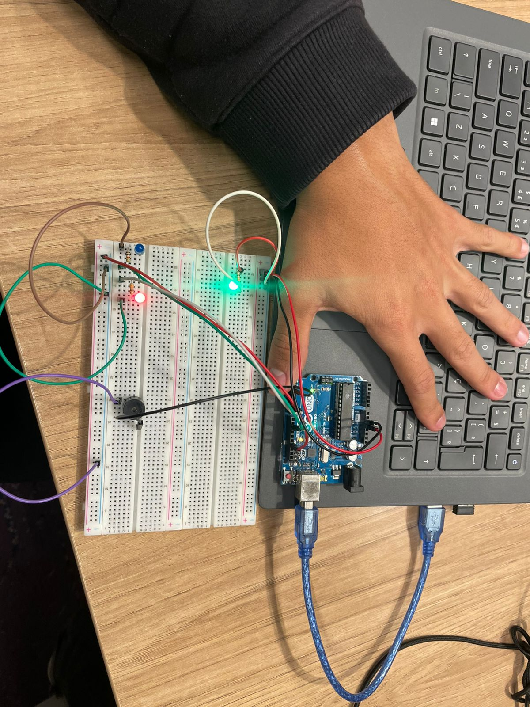

#  Projeto: Pisca-Pisca com Arduino Uno (Parte 2 - Ponderada)

## Descrição do Projeto
Este projeto consiste em uma simulação de **pisca-pisca com Arduino Uno**, utilizando dois LEDs **off-board**, um **buzzer** e resistores conectados a um **protoboard**.  
O sistema alterna o acendimento dos LEDs e o som emitido pelo buzzer, criando um efeito visual e sonoro de alerta com cadência regular.

O circuito e o código foram desenvolvidos e testados no **Tinkercad**, conforme solicitado na **Parte 2 da Ponderada**.

## Arduino colectado com alternância do led (inicial)

Led acendendo no tempo X de 500ms e apagando no Y com 500ms.

<br>
<p align="center">
  
</p>
<br>

---

## Componentes Utilizados

| Quantidade | Componente | Função |
|-------------|-------------|--------|
| 1 | Arduino Uno R3 | Microcontrolador principal |
| 1 | Protoboard | Montagem do circuito |
| 2 | LEDs (off-board) | Indicadores luminosos |
| 2 | Resistores de 1 KΩ | Proteção dos LEDs |
| 1 | Buzzer (ativo ou passivo) | Emissão sonora intermitente |
| Vários | Jumpers | Ligações entre pinos, resistores e GND |

## Circuito Montado

<br>
<p align="center">
  
</p>
<br>
---

## Ligações no Protoboard

| Componente | Pino Arduino | Observação |
|-------------|---------------|------------|
| LED 1 | 10 | Ânodo no pino 10, cátodo com resistor até o GND |
| LED 2 | 6 | Ânodo no pino 6, cátodo com resistor até o GND |
| Buzzer | 2 | Terminal positivo no pino 2, terminal negativo no GND |
| Protoboard | 5V / GND | Alimentação geral dos componentes |

---

## Código Fonte

```cpp
const int led1 = 10; 
const int led2 = 6; 
const int som = 2; 

void setup() {
  pinMode(led1, OUTPUT); 
  pinMode(led2, OUTPUT); 
  pinMode(som, OUTPUT); 
}

void loop() {
  digitalWrite(led1, LOW);
  digitalWrite(led2, HIGH); 
  digitalWrite(som, HIGH); 
  delay(500); 
  
  digitalWrite(led1, HIGH); 
  digitalWrite(led2, LOW); 
  digitalWrite(som, LOW); 
  delay(500);
}

```


## Acesse o link no Tinkercad
[Acesse o projeto no Tinkercad](https://www.tinkercad.com/things/dMapkmPRBSW/editel)


### Projeto no Tinkercad
<br>
<p align="center">
  
</p>
<br>