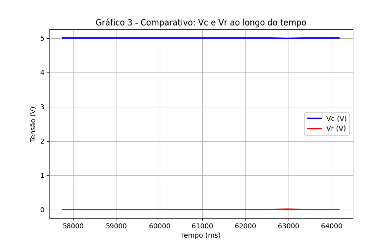

## Sistema

 

  

 

## Plot e comparação dos gráficos

 

  

 

 

  

 

 

  

 

## Sistema fisico

 

  

 

## Graficos com dados do fisico

 

  

 

 

  

 

 

  

 

### OBS:

o sistema quebra pois o resistor para descarga nao e o suficiente não suportando a capacidade
