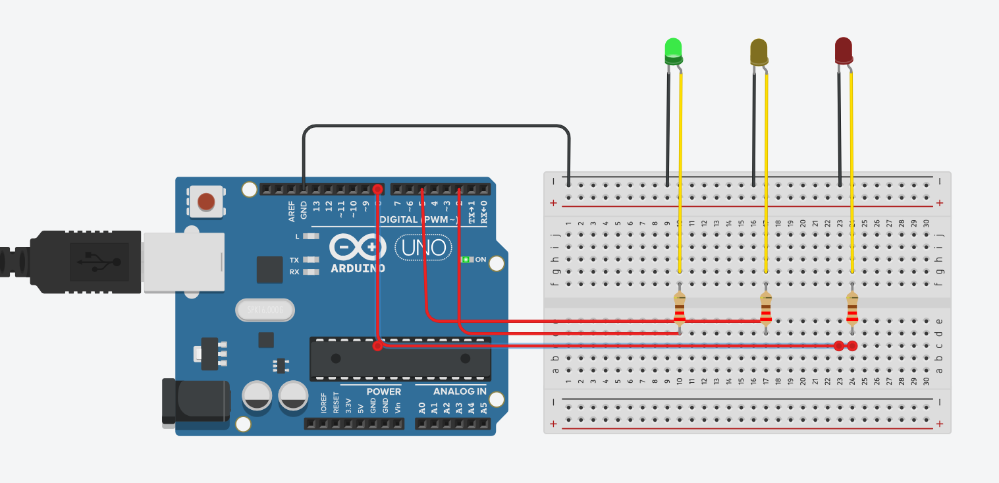

# Projeto: Semáforo com Arduino

## Descrição

Este projeto implementa um **semáforo eletrônico** utilizando **Arduino**, **LEDs** e **resistores**.  
O objetivo é demonstrar o funcionamento de um sistema de sinalização luminosa com tempos controlados, alternando entre **vermelho**, **verde** e **amarelo**, seguindo as etapas do ciclo de um semáforo real.

---

## Montagem do Circuito

### Conexões dos LEDs

| Cor do LED | Pino Digital | Resistor | Observação           |
| ---------- | ------------ | -------- | -------------------- |
| Verde      | 2            | 220 Ω    | Representa “siga”    |
| Amarelo    | 5            | 220 Ω    | Representa “atenção” |
| Vermelho   | 8            | 220 Ω    | Representa “pare”    |


---

## Componentes Utilizados

| Componente     | Quantidade | Especificação         | Função                             |
| -------------- | ---------- | --------------------- | ---------------------------------- |
| Arduino UNO    | 1          | 5V, 14 pinos digitais | Controlar os LEDs                  |
| LED Vermelho   | 1          | 5mm                   | Indica o sinal de “pare”           |
| LED Amarelo    | 1          | 5mm                   | Indica o sinal de “atenção”        |
| LED Verde      | 1          | 5mm                   | Indica o sinal de “siga”           |
| Resistor       | 3          | 220 Ω                 | Limita corrente dos LEDs           |
| Protoboard     | 1          | 830 pontos            | Montagem do circuito               |
| Jumpers (fios) | Vários     | Macho-macho           | Conexão entre Arduino e protoboard |
|Jumpers (fios) | 6 | Macho-femea | Conexão entre led e protoboard |
---

## Código do Semáforo (POO)

```cpp
c// Classe Semaforo
class Semaforo {
  private:
    int pinoVermelho;
    int pinoAmarelo;
    int pinoVerde;

  public:
    // Construtor
    Semaforo(int vermelho, int amarelo, int verde) {
      pinoVermelho = vermelho;
      pinoAmarelo = amarelo;
      pinoVerde = verde;

      pinMode(pinoVermelho, OUTPUT);
      pinMode(pinoAmarelo, OUTPUT);
      pinMode(pinoVerde, OUTPUT);
    }

    // Métodos
    void vermelho() {
      digitalWrite(pinoVermelho, HIGH);
      digitalWrite(pinoAmarelo, LOW);
      digitalWrite(pinoVerde, LOW);
    }

    void verde() {
      digitalWrite(pinoVermelho, LOW);
      digitalWrite(pinoAmarelo, LOW);
      digitalWrite(pinoVerde, HIGH);
    }

    void amarelo() {
      digitalWrite(pinoVermelho, LOW);
      digitalWrite(pinoAmarelo, HIGH);
      digitalWrite(pinoVerde, LOW);
    }

    void iniciarCiclo() {
      vermelho();
      delay(6000);
      verde();
      delay(4000);
      amarelo();
      delay(2000);
    }
};

// Criação do ponteiro
Semaforo* semaforoPrincipal = nullptr; // Ponteiro para objeto Semaforo

void setup() {
  // Cria dinamicamente o objeto Semaforo e guarda o endereço no ponteiro
  semaforoPrincipal = new Semaforo(8, 5, 2);
}

void loop() {
  // Usa o operador "->" para acessar métodos via ponteiro
  semaforoPrincipal->iniciarCiclo();
}

```

---

## Funcionamento

O código define uma classe `Semaforo` que controla os LEDs.  
A função `iniciarCiclo()` executa a sequência de sinais, alternando entre **vermelho**, **verde** e **amarelo** com tempos pré-determinados.  
O loop principal chama `iniciarCiclo()` para repetir o ciclo de sinais.

---

## Outra forma Sem (POO)

```cpp
// Definição dos pinos
int ledVermelho = 8;
int ledAmarelo = 5;
int ledVerde = 2;

void setup() {
  // Define os pinos como saída
  pinMode(ledVermelho, OUTPUT);
  pinMode(ledAmarelo, OUTPUT);
  pinMode(ledVerde, OUTPUT);
}

void loop() {
   // --- Fase VERMELHA ---
  digitalWrite(ledVermelho, HIGH);   // acende vermelho
  digitalWrite(ledAmarelo, LOW);
  digitalWrite(ledVerde, LOW);
  delay(6000); // 6 segundos

  // --- Fase VERDE ---
  digitalWrite(ledVermelho, LOW);
  digitalWrite(ledAmarelo, LOW);
  digitalWrite(ledVerde, HIGH);      // acende verde
  delay(4000); // 4 segundos

  // --- Fase AMARELA ---
  digitalWrite(ledVermelho, LOW);
  digitalWrite(ledAmarelo, HIGH);    // acende amarelo
  digitalWrite(ledVerde, LOW);
  delay(2000); // 2 segundos
}
```

---

## Avaliadores

| Nome do Avaliador            | Função / Papel         | Assinatura / Confirmação   |
| ---------------------------- | ---------------------- | -------------------------- |
| Avaliador 1: [Nome completo] | Colega de turma        | ************\_************ |
| Avaliador 2: [Nome completo] | Colega de turma        | ************\_************ |
| Avaliador 3: [Nome completo] | Professor / Orientador | ************\_************ |

---

## Versao montada no Tinkercad

<br>
<p align="center">
  
</p>
<br>

---------

### Explicação 

Como podemos ver temos 3 leds conectados cada um individualmente a 2 cabos macho e femea, sendo eles o vermelho, amarelo e verde. Cada led está conectado a um resistor de 220 ohms e o catodo de cada led está conectado ao GND da protoboard. O anodo de cada led está conectado a um pino digital do arduino. O pino digital 8 está conectado ao led vermelho, o pino digital 5 está conectado ao led amarelo e o pino digital 2 está conectado ao led verde.

e para o funcionamento do semaforo temos o codigo acima que controla os leds e os tempos de cada fase.

----------

### Esquema de ligação

Cada LED está conectado ao seu respectivo pino digital através de um **resistor** (para limitar a corrente e evitar danos ao LED) e a conexão é feita via jumpers macho e femea para o anodo do led.  
O **catodo (perna menor)** de cada LED está ligado ao **GND** da protoboard via jumper macho e femea ligada ao catodo do led, assim deixando o led individualmente conectado e suspenso a protoboard.


## Versão fisica 

<br>
<p align="center">
  
</p>
<br>

----

<br>
<p align="center">
  
</p>
<br>

### Link do video:
[Visite o video da atividade](https://drive.google.com/file/d/1yJIkYknmAZNpArU6hLd5_A8Tq8ItN92y/view?usp=sharing))


### OBS:

Nada foi alterado na fisica, apenas foi adicionado um resistor de 220 ohms em cada led para limitar a corrente e evitar danos ao led. 
a codição de organização fisica tambem não ficou tão boa.